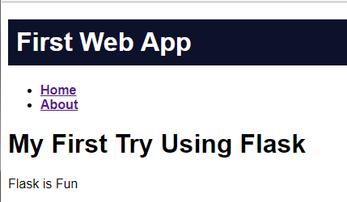

# Python Programming Crash Course

*Don't miss out, start your career as a Coder!*

There's been a lot of talk about automation and the effect it's going to have on the jobs market.

[World economic forum forecast](https://www.washingtonpost.com/technology/2018/09/18/machines-will-create-million-more-jobs-than-they-displace-by-world-economic-forum-says/?noredirect=on&utm_term=.f87b5c28833d)

>In the next four years, more than 75 million jobs may be lost as companies shift to more automation, according to new estimates by the World Economic Forum. But the projections have an upside: 133 million new jobs will emerge during that period, as businesses develop a new division of labor between people and machines.

Automation will create many more jobs than it replaces, but only if you have the right skills - Programming Skills!

## Day 1 - Python Programming for Beginners 

Saturday 10th August 10am - 4pm

## Day 2 - Intermediate Python Programming

Saturday 17th August 10am - 4pm

The 12 hour crash course run over two weekends is one of the best ways to get started with Python programming. 

It is hands on and interactive so you will actually learn how to program rather than hearing a lot of theory about what programming is.

You will get experience with:

- Planning a project
- Solving problems step by step
- De-bugging
- Creating Web Apps
- Data Analysis

# Topics Include

## The Jupyter Notebook as a Data Science environment

Use datascience to inform and predict

## Natural Language Processing using Twitter Data

Use Python for insight into what social media thinks

## Web Apps with Flask

create useful and entertaining web applications from simple utilities to full websites

# Follow this link to General Assembly to [SIGN UP!](https://generalassemb.ly/education/python-programming-crash-course/melbourne/79206)